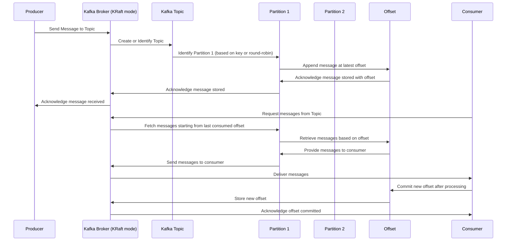

# Kafka-Producers-Consumer-

Here's a Mermaid sequence diagram illustrating the interaction between a Kafka Producer, Kafka running in KRaft mode (no Zookeeper), Topics, Partitions, Offsets, and Consumers:

### Explanation:

- **Producer** sends a message to a Kafka **Broker** running in KRaft mode.
- The **Kafka Broker** identifies or creates the appropriate **Topic**.
- The **Topic** determines which **Partition** the message should go to (based on a key or round-robin).
- The **Partition** appends the message at the latest **Offset**.
- The **Offset** keeps track of the message position in the **Partition**.
- The **Kafka Broker** acknowledges the successful storage of the message to the **Producer**.
- **Consumers** request messages from the **Topic**.
- The **Kafka Broker** fetches messages starting from the last committed **Offset** for that **Consumer**.
- The **Partition** retrieves messages based on the **Offset**.
- The **Consumer** processes the messages and commits the new **Offset** after processing.
- The **Kafka Broker** stores the new **Offset** and acknowledges the commit to the **Consumer**.

This sequence diagram provides a high-level overview of the message flow in a Kafka environment using KRaft mode, which operates without Zookeeper.
