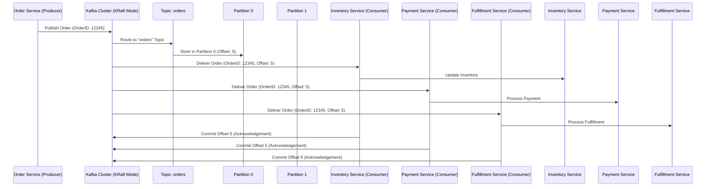
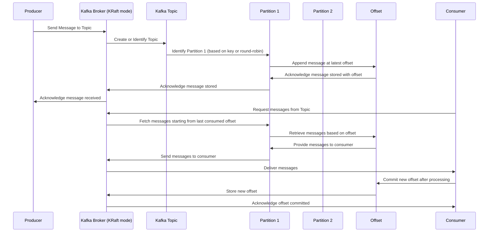

# Kafka-Producers-Consumer-

### Use Case: Real-Time Order Processing System with Kafka in Kraft Mode

**Scenario**:  
An e-commerce platform wants to implement a real-time order processing system where incoming orders are processed immediately for inventory updates, payment processing, and order fulfillment. Kafka in Kraft mode (KRaft, Kafka Raft) is used to remove the dependency on Zookeeper, streamlining the architecture and improving fault tolerance.

### Key Components:
- **Producer**: The order service that produces messages (orders) to Kafka topics.
- **Kafka in Kraft Mode**: Kafka cluster operating without Zookeeper, using Raft protocol for consensus.
- **Topics**: Kafka topics to which the orders are published. For instance, an "orders" topic.
- **Partitions**: Each topic can be divided into partitions to distribute the load.
- **Offset**: The position of a message within a partition, used to track consumer progress.
- **Consumers**: Services that consume messages from Kafka topics, such as Inventory Service, Payment Service, and Fulfillment Service.

### Sequence Diagram

Here's a sequence diagram illustrating the flow of the order processing system:



### Explanation:

1. **Order Service (Producer)**:
   - The Order Service produces an order message with `OrderID: 12345` and sends it to the Kafka cluster.

2. **Kafka Cluster in KRaft Mode**:
   - The Kafka cluster, operating in KRaft mode, receives the order message and routes it to the appropriate topic named `orders`.
   - The message is stored in one of the topic's partitions (e.g., Partition 0) with an `Offset` of 5.

3. **Consumers**:
   - The message is delivered to multiple consumers:
     - **Inventory Service**: Updates inventory based on the order.
     - **Payment Service**: Processes the payment for the order.
     - **Fulfillment Service**: Handles the fulfillment and shipping of the order.
   - Each consumer processes the message and commits the offset back to Kafka, acknowledging that the message has been successfully processed.

4. **Partitioning**:
   - Kafka distributes messages across partitions to balance the load. In this case, the message was stored in Partition 0. If there are more partitions, messages could be distributed based on a key (like `OrderID`) or round-robin fashion.

### Benefits of Using KRaft Mode:
- **Eliminates Zookeeper Dependency**: KRaft mode removes the need for Zookeeper, simplifying the architecture.
- **Enhanced Fault Tolerance**: Raft protocol ensures that the cluster can achieve consensus even in the event of node failures.
- **Scalability**: Kafka's partitioning mechanism allows for scalable consumption of messages, ensuring that high-throughput applications can handle large volumes of data.

This setup ensures that the order processing system is robust, scalable, and capable of handling real-time order events efficiently.

Here's a sequence diagram illustrating the interaction between a Kafka Producer, Kafka running in KRaft mode (no Zookeeper), Topics, Partitions, Offsets, and Consumers:



### Explanation:

- **Producer** sends a message to a Kafka **Broker** running in KRaft mode.
- The **Kafka Broker** identifies or creates the appropriate **Topic**.
- The **Topic** determines which **Partition** the message should go to (based on a key or round-robin).
- The **Partition** appends the message at the latest **Offset**.
- The **Offset** keeps track of the message position in the **Partition**.
- The **Kafka Broker** acknowledges the successful storage of the message to the **Producer**.
- **Consumers** request messages from the **Topic**.
- The **Kafka Broker** fetches messages starting from the last committed **Offset** for that **Consumer**.
- The **Partition** retrieves messages based on the **Offset**.
- The **Consumer** processes the messages and commits the new **Offset** after processing.
- The **Kafka Broker** stores the new **Offset** and acknowledges the commit to the **Consumer**.

This sequence diagram provides a high-level overview of the message flow in a Kafka environment using KRaft mode, which operates without Zookeeper.


### Implementation steps

### Integrating Kafka with Azure Event Hubs for Streaming Analytics and Event-Driven Processing

**Scenario**:  
A company is leveraging Apache Kafka for high-throughput, real-time data streaming and processing across multiple microservices within their Azure Kubernetes Service (AKS) cluster. To extend its capabilities, the company wants to integrate Kafka with Azure Event Hubs, enabling seamless integration with other Azure services like Azure Stream Analytics, Azure Functions, and Azure Synapse Analytics for real-time analytics, data transformation, and event-driven workflows.

### Reasons for Integration

1. **Scalability**: Azure Event Hubs is a highly scalable event ingestion service capable of processing millions of events per second. By integrating Kafka with Event Hubs, the company can handle a massive influx of events and extend Kafka's reach beyond the AKS cluster.

2. **Integration with Azure Services**: Event Hubs seamlessly integrates with other Azure services like Azure Stream Analytics, Azure Data Lake Storage, Azure Functions, and more, enabling advanced analytics and processing.

3. **Geo-Replication and Reliability**: Event Hubs provides built-in geo-replication and fault tolerance, which can enhance the reliability of Kafka's event streaming across different regions.

4. **Hybrid and Multi-Cloud Architecture**: For organizations with a hybrid or multi-cloud strategy, integrating Kafka with Event Hubs enables cross-cloud data movement and real-time event processing.

### Steps to Integrate Kafka with Azure Event Hubs

#### 1. **Provision Azure Event Hubs Namespace and Event Hub**

   **Steps**:
   - **Create an Event Hubs Namespace**:
     ```bash
     az eventhubs namespace create \
       --name kafka-eventhubs-namespace \
       --resource-group confluence-kafka-rg \
       --location <location>
     ```

   - **Create an Event Hub**:
     ```bash
     az eventhubs eventhub create \
       --resource-group confluence-kafka-rg \
       --namespace-name kafka-eventhubs-namespace \
       --name kafka-eventhub \
       --message-retention 7 \
       --partition-count 4
     ```

#### 2. **Configure Kafka to Integrate with Event Hubs**

   **Steps**:
   - **Create a Kafka Connector**:
     - Use Kafka Connect to set up a connector to Azure Event Hubs.
     - A connector is a plug-in for Kafka that streams data between Kafka topics and external systems, in this case, Azure Event Hubs.
     - Configure the connector with the necessary Event Hubs connection string and topic configurations.

     Example configuration (using Kafka Connect):
     ```json
     {
       "name": "azure-eventhubs-connector",
       "config": {
         "connector.class": "io.confluent.connect.azure.eventhubs.EventHubsSourceConnector",
         "tasks.max": "1",
         "kafka.topic": "kafka-topic",
         "eventhubs.namespace": "kafka-eventhubs-namespace",
         "eventhubs.name": "kafka-eventhub",
         "eventhubs.sas.keyname": "RootManageSharedAccessKey",
         "eventhubs.sas.key": "<YourEventHubKey>",
         "eventhubs.consumer.group": "$Default",
         "max.events": "1000",
         "poll.interval.ms": "100"
       }
     }
     ```
     - Deploy this configuration to Kafka Connect to start streaming data from Kafka topics to Azure Event Hubs.

#### 3. **Enable Event Streaming from Kafka to Azure Event Hubs**

   **Steps**:
   - **Producer Application**:
     - Modify your Kafka producer application to produce events to the Kafka topics that are configured to stream to Event Hubs via the Kafka connector.
     - This will allow Kafka topics to send events directly to Azure Event Hubs.

   - **Consumer Application**:
     - Create consumer applications or use Azure services like Azure Stream Analytics to process the data from Event Hubs.

#### 4. **Leverage Azure Services for Event Processing**

   **Steps**:
   - **Azure Stream Analytics**:
     - Set up an Azure Stream Analytics job to process data in real-time as it arrives in Azure Event Hubs.
     - Define the input as the Event Hub, and the output can be an Azure SQL Database, Data Lake Storage, or Power BI for visualization.
     
   - **Azure Functions**:
     - Deploy Azure Functions that trigger off the events in Event Hubs. This enables serverless event-driven processing, such as data transformation, notifications, or further data streaming.
     
   - **Azure Synapse Analytics**:
     - Integrate Azure Event Hubs with Synapse to load streaming data into a data warehouse for further analytics, enabling complex queries across large datasets in real-time.

#### 5. **Implement Monitoring and Scaling**

   **Steps**:
   - **Azure Monitor**:
     - Use Azure Monitor to track the health and performance of your Event Hubs and Kafka connector.
     - Set up alerts for key metrics such as throughput, message latency, and errors.
     
   - **Auto-Scaling**:
     - Configure auto-scaling for Event Hubs to handle fluctuating event loads, ensuring that the event streaming pipeline remains efficient and responsive.

### Summary

Integrating Kafka with Azure Event Hubs extends the capabilities of your event streaming platform, enabling real-time data processing, advanced analytics, and seamless integration with the Azure ecosystem. This setup provides a scalable, reliable, and highly integrated solution for handling large-scale event-driven architectures and streaming analytics in a hybrid or multi-cloud environment.
