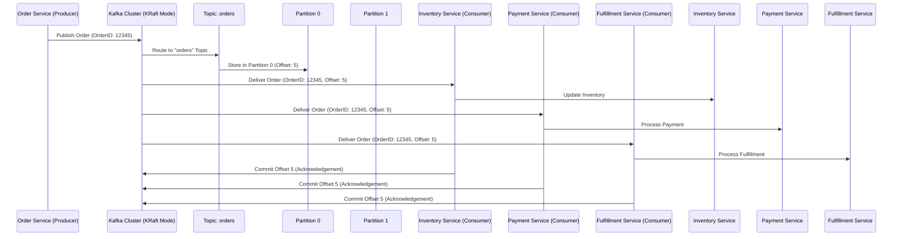
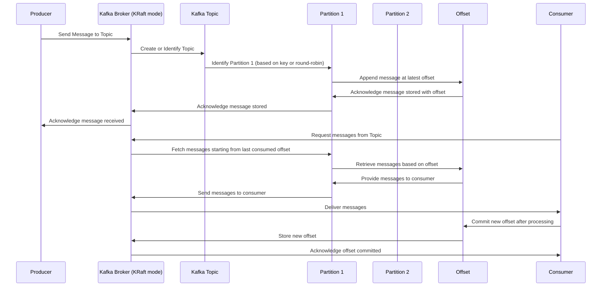

# Kafka-Producers-Consumer-

### Use Case: Real-Time Order Processing System with Kafka in Kraft Mode

**Scenario**:  
An e-commerce platform wants to implement a real-time order processing system where incoming orders are processed immediately for inventory updates, payment processing, and order fulfillment. Kafka in Kraft mode (KRaft, Kafka Raft) is used to remove the dependency on Zookeeper, streamlining the architecture and improving fault tolerance.

### Key Components:
- **Producer**: The order service that produces messages (orders) to Kafka topics.
- **Kafka in Kraft Mode**: Kafka cluster operating without Zookeeper, using Raft protocol for consensus.
- **Topics**: Kafka topics to which the orders are published. For instance, an "orders" topic.
- **Partitions**: Each topic can be divided into partitions to distribute the load.
- **Offset**: The position of a message within a partition, used to track consumer progress.
- **Consumers**: Services that consume messages from Kafka topics, such as Inventory Service, Payment Service, and Fulfillment Service.

### Sequence Diagram

Here's a sequence diagram illustrating the flow of the order processing system:

### Explanation:

1. **Order Service (Producer)**:
   - The Order Service produces an order message with `OrderID: 12345` and sends it to the Kafka cluster.

2. **Kafka Cluster in KRaft Mode**:
   - The Kafka cluster, operating in KRaft mode, receives the order message and routes it to the appropriate topic named `orders`.
   - The message is stored in one of the topic's partitions (e.g., Partition 0) with an `Offset` of 5.

3. **Consumers**:
   - The message is delivered to multiple consumers:
     - **Inventory Service**: Updates inventory based on the order.
     - **Payment Service**: Processes the payment for the order.
     - **Fulfillment Service**: Handles the fulfillment and shipping of the order.
   - Each consumer processes the message and commits the offset back to Kafka, acknowledging that the message has been successfully processed.

4. **Partitioning**:
   - Kafka distributes messages across partitions to balance the load. In this case, the message was stored in Partition 0. If there are more partitions, messages could be distributed based on a key (like `OrderID`) or round-robin fashion.

### Benefits of Using KRaft Mode:
- **Eliminates Zookeeper Dependency**: KRaft mode removes the need for Zookeeper, simplifying the architecture.
- **Enhanced Fault Tolerance**: Raft protocol ensures that the cluster can achieve consensus even in the event of node failures.
- **Scalability**: Kafka's partitioning mechanism allows for scalable consumption of messages, ensuring that high-throughput applications can handle large volumes of data.

This setup ensures that the order processing system is robust, scalable, and capable of handling real-time order events efficiently.

Here's a sequence diagram illustrating the interaction between a Kafka Producer, Kafka running in KRaft mode (no Zookeeper), Topics, Partitions, Offsets, and Consumers:

### Explanation:

- **Producer** sends a message to a Kafka **Broker** running in KRaft mode.
- The **Kafka Broker** identifies or creates the appropriate **Topic**.
- The **Topic** determines which **Partition** the message should go to (based on a key or round-robin).
- The **Partition** appends the message at the latest **Offset**.
- The **Offset** keeps track of the message position in the **Partition**.
- The **Kafka Broker** acknowledges the successful storage of the message to the **Producer**.
- **Consumers** request messages from the **Topic**.
- The **Kafka Broker** fetches messages starting from the last committed **Offset** for that **Consumer**.
- The **Partition** retrieves messages based on the **Offset**.
- The **Consumer** processes the messages and commits the new **Offset** after processing.
- The **Kafka Broker** stores the new **Offset** and acknowledges the commit to the **Consumer**.

This sequence diagram provides a high-level overview of the message flow in a Kafka environment using KRaft mode, which operates without Zookeeper.
